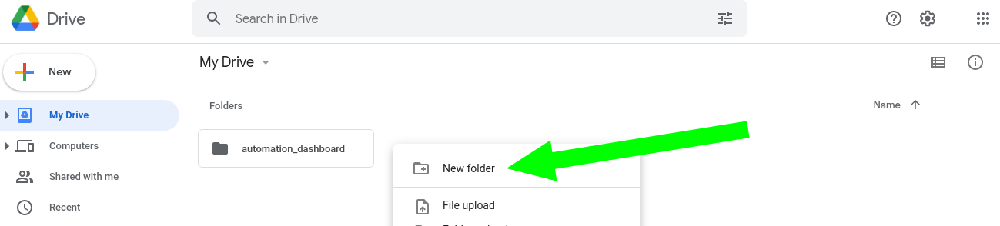
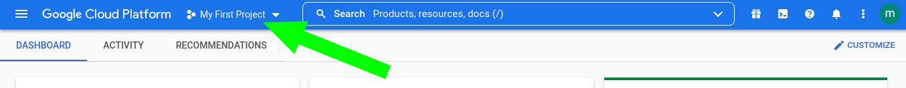
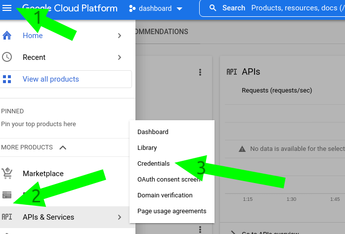
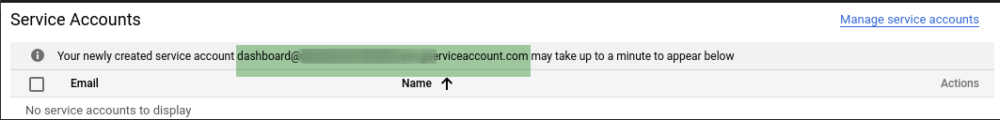

# Pipelines for Automation Dashboards

This is how was created the pipeline for get data to create the Automation dashboards

## 1. Create a project in Google Drive

You need to create a project folder to save the following files:
* Colab Notebook
* Json key from project Google Cloud project.
* *Google Sheet* with data to ingest the dashboard.

## 2. Get data from databases into the Jupyter Notebook

### 2.1 Google Clud Platform

2.1.1 Create a project in Google Cloud Platform in order to connect the spreadsheets:

2.1.2 Enable the APIs in the Google Cloud project. [Enable the APIs you want to use](https://developers.google.com/workspace/guides/enable-apis), for this project:  
* Google Sheets API 
* Google Drive API

2.1.3 Create access credentials: Service account type.
* Create key json type.
* Save into a drive folder.

2.1.4 Create a *Google Sheet* in the drive project folder and share with the *service account email*.

## 2. Send cleaned data into the Google sheets

## 3. Import data into de Google Data Studio